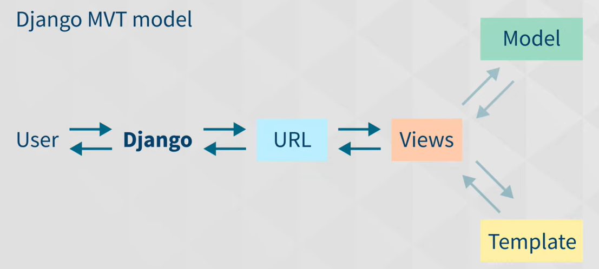

### Definition of Django
Django is a high-level, open-source Python web framework that enables rapid development of secure, scalable, and maintainable web applications.

It follows the MVT (Model–View–Template) architectural pattern and comes with many built-in features such as:
- ORM (Object Relational Mapper)
- Authentication & authorization
- Admin panel
- Security protections (CSRF, SQL injection, XSS)
- URL routing
- Template engine
---

#### Django vs Flask
| Feature           | Django                      | Flask                      |
| ----------------- | --------------------------- | -------------------------- |
| Type              | Full-stack framework        | Micro-framework            |
| Built-in features | ORM, Admin, Auth, Forms     | Minimal, add extensions    |
| Learning curve    | Steeper                     | Easier                     |
| Project structure | Opinionated                 | Flexible                   |
| Use case          | Large, complex applications | Small to medium apps, APIs |

---

#### Django vs FastAPI
| Feature           | Django                | FastAPI                  |
| ----------------- | --------------------- | ------------------------ |
| Primary focus     | Full web applications | High-performance APIs    |
| Performance       | Good                  | Very high (ASGI, async)  |
| Async support     | Partial               | Native async             |
| API documentation | Manual                | Auto-generated (Swagger) |
| Use case          | Web apps + APIs       | Microservices & APIs     |

---

#### Why use Django Framework?

- Rapid Development
- Security
- Scalability
- Built-in Admin Panel
- ORM (Object Relational Mapper)
- Clean & Maintainable Code
- HTTP Libraries
- MVT Architecture

---

#### Other Important Content You Might Have Missed

- MVT Architecture (Django Pattern)
- Django REST Framework (DRF)
  - Used to build REST APIs
    - Features:
    - Serialization
    - Authentication
    - Permissions
    - Pagination
- URL Routing

---

#### When NOT to use Django
- Very small applications
- Lightweight microservices
- Real-time, high-performance APIs (FastAPI preferred)

---

#### How Django Actually works?
IT works on MVT Achitecture 
M - Model -> it talk to database
V - View -> It only handle the request the request and response, The View contains the business logic of the application.
T - Template -> The Template is the presentation layer (UI).

Flow - 
  - User sends a request via browser
  - URL dispatcher maps URL to a View
  - View processes request
  - View fetches data from Model
  - View sends data to Template
  - Template renders HTML
  - Response is sent back to the user


---

#### Basic Command to run the Django
1. Create the env
```
python -m venv venv
venv\Scripts\activate
```
2. Install Django
```
pip install django
```
3. Create a Django Project
```
django-admin startproject myproject
cd myproject
```
4. Run Django Development Server

```
python manage.py runserver
go to - http://127.0.0.1:8000/
Run on differnet port - python manage.py runserver 8001
```
5. Create a Django App
```
python manage.py startapp myapp
```
6. Make and Apply Migrations
```
python manage.py makemigrations
python manage.py migrate
```
7. Create Super User
```
python manage.py createsuperuser
```

##### Extra: 
- Note: Most Asked Interview Commands (Quick List)
```
django-admin startproject projectname
python manage.py startapp appname
python manage.py runserver
python manage.py makemigrations
python manage.py migrate
python manage.py createsuperuser
```

- “To run Django, we use python manage.py runserver, which starts the development server on port 8000 by default.”

---

Creating admin login code -
(venv) PS C:\Users\sp735\Desktop\New folder\python\Django\Learning\Todo> python manage.py createsuperuser
Username (leave blank to use 'sp735'): djangodmin
Email address: suraj.prajapati@altysys.com
Password: 
Password (again): 
Superuser created successfully.

